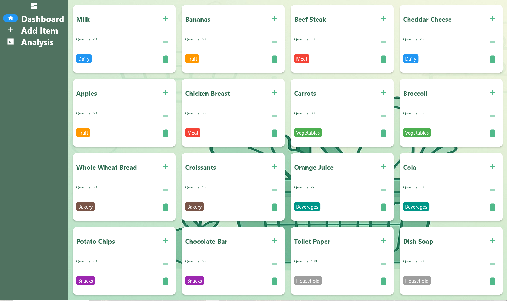
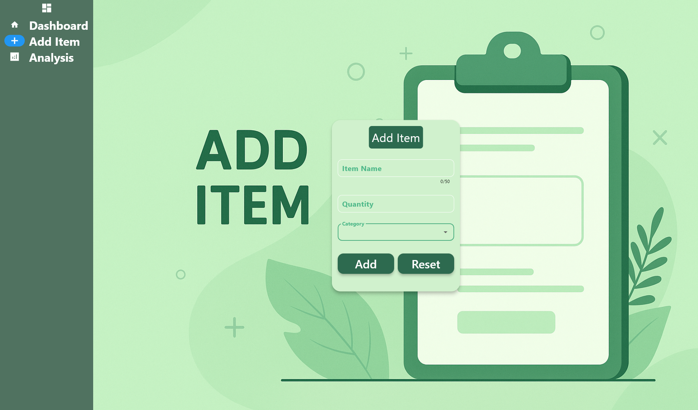
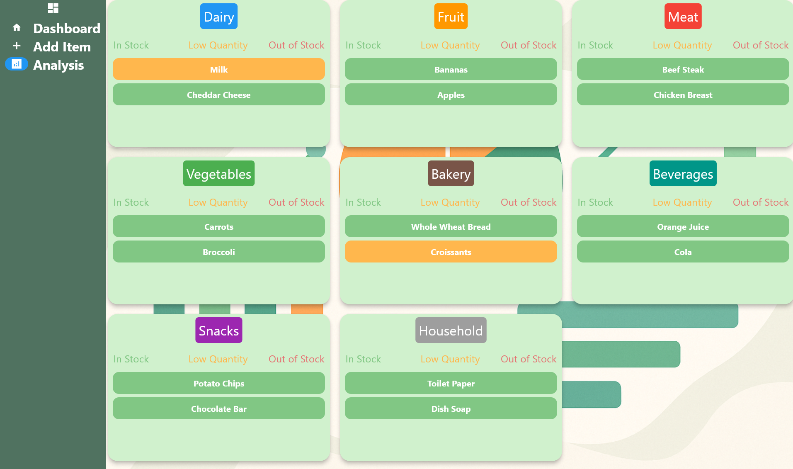

# 🛒 Grocery App

A simple Flutter app to manage groceries efficiently.  
The app provides a **Dashboard** to view items, an **Add Item** screen to insert new groceries, and an **Analysis** screen for insights.

## 🎥 Demo
👉 [Watch Demo Video](https://drive.google.com/drive/folders/1FKB2pQNArFzEVcoj83yb_EEcaXDUreYE?usp=drive_link)

## ✨ Features
- 📊 **Dashboard** – View all grocery items in one place.
- ➕ **Add Item** – Quickly add new grocery items with details.
- 📈 **Analysis Screen** – Visualize consumption and track grocery trends.
- 🎨 Clean & simple UI with Flutter.

## Screenshots

### Dashboard Screen

### Add Item  Screen

### Analysis Screen

