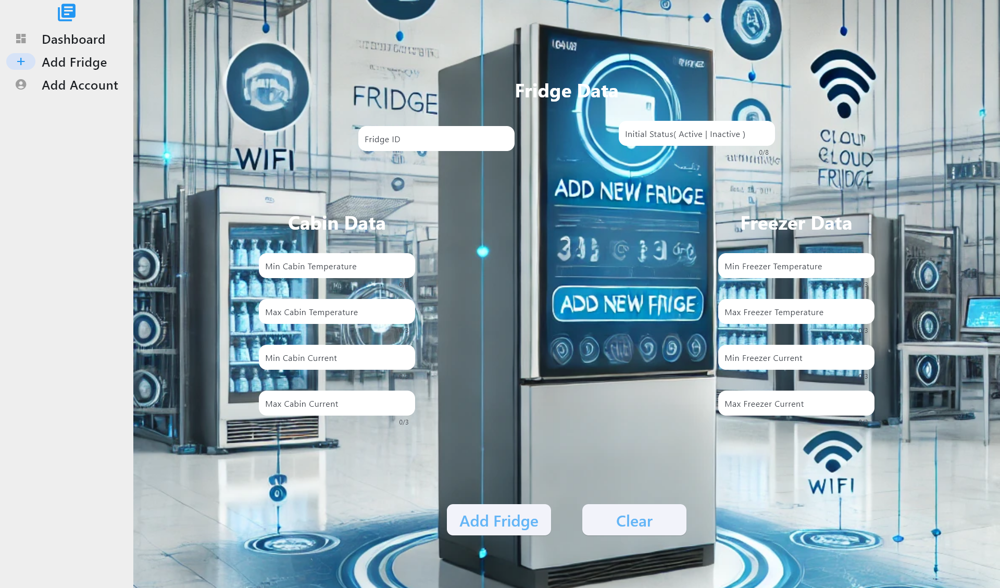

# Smart Fridge Monitoring App

A **Flutter-based application** for real-time monitoring and management of smart fridges in a **production line**.  
The app visualizes **temperature** and **current data** of the **cabin** and **freezer** sections using **graphs and dashboards**, enabling factory staff to monitor fridge performance efficiently.

---

## Demo
[Watch Demo Video](https://drive.google.com/file/d/1mA4eE4Tr2SPAlEKWHmNUTrKsBrK8XGI4/view?usp=sharing)

---

## Features
- **Dashboard** – Real-time visualization of temperature and current data.  
- **Add Fridge** – Register and configure new fridge units into the system.  
- **Add Account** – Manage user accounts for factory staff.  
- **Alerts** – Notify staff when readings go beyond safe thresholds.  
 

---

## Screenshots

### Dashboard  

### Add Fridge  

### Add Account  

